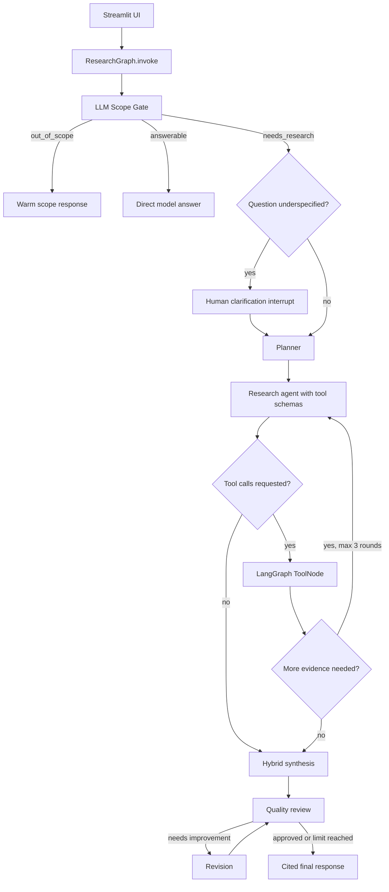
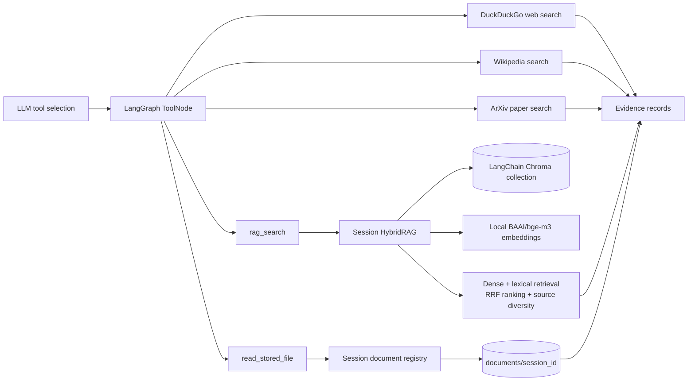
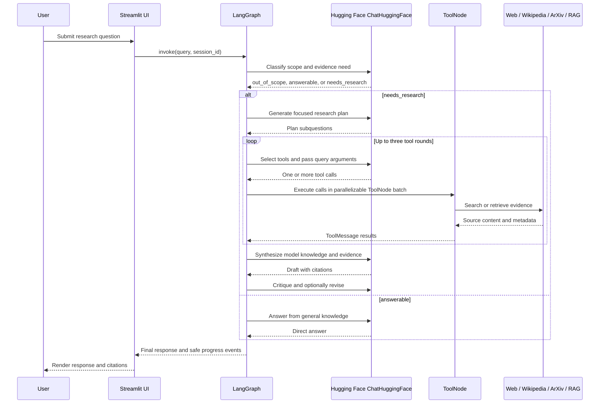

# Research Agent

Research Agent is a Python-only, research-focused assistant. It investigates questions with multiple external sources, optionally grounds answers in uploaded documents, checks the draft for quality, and returns a structured research brief. It is deliberately not a general-purpose chatbot: requests that are not research, evidence, comparison, investigation, or analysis are answered with a research-scope message.

## Goals

- Use the Hugging Face hosted chat interface with Llama 3.1 8B Instruct.
- Keep embeddings local with `BAAI/bge-m3` and persist vectors in Chroma.
- Isolate every conversation in a UUID session with separate documents and Chroma storage.
- Use LangGraph for explicit stateful orchestration and LangGraph `ToolNode` execution.
- Search the web, Wikipedia, and ArXiv when the question requires external evidence.
- Support optional PDF, DOCX, TXT, Markdown, CSV, JSON, HTML, XML, Python, Excel, and PowerPoint document collections.
- Improve answer quality with parsing, source grounding, critique, and revision.
- Preserve short-term conversation context while compressing older turns and extracting user preferences.
- Pause for human clarification when a research request is underspecified.
- Show safe high-level research progress in Streamlit and detailed node, tool-query, and LLM timing logs in the terminal.

## Architecture

### Request routing



### Tool and knowledge layers



### Research orchestration sequence



The LLM-backed scope gate classifies each request as `out_of_scope`, `answerable`, or `needs_research`. Out-of-scope requests receive a natural scope response; answerable research questions use a direct model answer; evidence-dependent questions route to clarification when needed, then planning, model-directed tool selection, source collection, hybrid synthesis, critique, and revision.

Each Streamlit session receives a UUID. Original uploads are preserved under `documents/<session_id>/`, the document registry is stored there, and the LangChain Chroma vector store is persisted under `.chroma/<session_id>/`. Starting a new session creates a new namespace and does not delete older session data.

The graph keeps the research state in `ResearchState` and persists it per thread with LangGraph `MemorySaver`. Tool results use LangChain's standard tool schema and are executed by LangGraph `ToolNode`, allowing the model to select tools through conditional routing. Hugging Face responses are plain text, so planning and critique use `PydanticOutputParser` with `OutputFixingParser` as a recovery layer.

The terminal log includes node start/end times, planner count and subquestions, selected tool names and arguments, tool latency, LLM response latency, response size, source counts, and critique scores. The UI displays only high-level progress states, not hidden chain-of-thought.

## Project structure

```text
research-agent/
|-- app.py                         Streamlit application and HITL controls
|-- requirements.txt               Python dependencies
|-- .env.example                   Safe configuration template
|-- .env                           Local configuration with placeholder token
|-- documents/                     Original uploads grouped by session UUID
|-- .chroma/                       LangChain Chroma data grouped by session UUID
|-- README.md
|-- research_agent/
	|-- config.py                  Environment-backed Settings object
	|-- llm.py                     Hugging Face chat model construction
	|-- graph.py                   LangGraph workflow and ToolNode orchestration
	|-- state.py                   Typed graph state
	|-- tools.py                   Web, Wikipedia, ArXiv, and quality tools
	|-- rag_system/                Standalone document indexing and hybrid retrieval package
		|-- rag_engine.py          Chroma document storage and hybrid retrieval
		|-- document_handler.py    File reading, uploads, metadata, listing, and chunk preparation
		|-- result_ranker.py       RRF fusion, cross-encoder reranking, and source diversity
		|-- main.py                 Terminal-only RAG inspection entry point
	|-- parsers.py                 Pydantic schemas and output-repair parsers
	|-- prompts/                   Planner, tool-selection, RAG, drafting, critique, and revision prompts
	|-- memory.py                  Recent turns, preference capture, and compression
```

## Configuration

`.env` and `.env.example` intentionally use the same keys:

```dotenv
HUGGINGFACEHUB_API_TOKEN=your_huggingface_read_token
LLM_MODEL_ID=meta-llama/Llama-3.1-8B-Instruct
EMBEDDING_MODEL_ID=BAAI/bge-m3
EMBEDDING_CACHE_DIR=.models
EMBEDDING_LOCAL_FILES_ONLY=false
HF_PROVIDER=auto
LLM_MAX_NEW_TOKENS=1024
LLM_TEMPERATURE=0.1
LLM_CALL_DELAY_SECONDS=20
MAX_RETRIES=3
CHROMA_DIR=.chroma
DOCUMENTS_DIR=documents
RAG_CHUNK_SIZE=900
RAG_CHUNK_OVERLAP=140
RAG_EMBEDDING_BATCH_SIZE=16
RAG_TOP_K=8
RAG_CANDIDATE_MULTIPLIER=6
RAG_RERANKER_MODEL_ID=BAAI/bge-reranker-v2-m3
RAG_RERANKER_ENABLED=true
RAG_RERANKER_LOCAL_FILES_ONLY=false
RAG_DENSE_WEIGHT=0.35
RAG_BM25_WEIGHT=0.25
RAG_CROSS_ENCODER_WEIGHT=0.40
MAX_RESEARCH_ITERATIONS=2
```

Replace only the placeholder token in `.env`. Do not commit a real token. `LLM_CALL_DELAY_SECONDS` is applied with `time.sleep()` immediately before each explicit model call in the graph, keeping throttling outside the model object.

The chat client accepts `HUGGINGFACEHUB_API_TOKEN1` through `HUGGINGFACEHUB_API_TOKEN5` or `HF_TOKEN1` through `HF_TOKEN5`. Configured values are deduplicated and selected round-robin for separate Hugging Face chat calls. Embeddings remain local and do not consume these tokens. If a token is exposed, revoke it and create a replacement before using the application again.

`MAX_RETRIES` is the single retry limit for hosted model calls, output-parser repair, and research tools. Retries use short exponential backoff and are capped by this value.

Uploaded documents are split into chunks and embedded in batches controlled by
`RAG_EMBEDDING_BATCH_SIZE`. Each batch is embedded together for CPU efficiency,
then written to Chroma as one serialized operation to avoid concurrent database
writes. The Streamlit upload status and terminal logs report each stored chunk.
Chunk metadata includes filename, title, headings, page, author, and year when
available. Retrieval combines dense similarity with body and metadata matching,
including lightweight spelling correction for query terms. Dense Chroma search
and lexical scoring run concurrently, their candidates are fused with reciprocal
rank fusion, and the candidates are reranked locally with the configured
cross-encoder. Set `RAG_RERANKER_ENABLED=false` for a faster first run or use
`RAG_RERANKER_LOCAL_FILES_ONLY=true` after downloading the model.
The final score is a weighted combination of normalized dense similarity,
normalized BM25, and normalized cross-encoder scores. The weights are
configured with `RAG_DENSE_WEIGHT`, `RAG_BM25_WEIGHT`, and
`RAG_CROSS_ENCODER_WEIGHT`.

## Setup and run

```powershell
.\venv\Scripts\python.exe -m pip install -r requirements.txt
.\venv\Scripts\python.exe -m streamlit run app.py
```

Open `http://localhost:8501`. `BAAI/bge-m3` runs locally through `HuggingFaceEmbeddings` on CPU and is cached in `.models`; the first run may download model weights, but embedding inference is local and does not use the hosted Hugging Face chat endpoint. Set `EMBEDDING_LOCAL_FILES_ONLY=true` after the model is cached to prevent any later model download attempts. A Hugging Face read token is required only for the hosted Llama chat endpoint.

### Check the RAG system separately

The RAG package can be indexed and queried without starting the research agent:

```powershell
.\venv\Scripts\python.exe -m research_agent.rag_system.main "what does this document say about pricing?" --input .\documents\sample.pdf --k 5
```

`--input` accepts one supported file or a directory. The command prints each
retrieved chunk, its ranking score, citation, chunk ID, and complete metadata.
The default `rag-cli` session is persistent, so later queries can reuse its
indexed chunks with `--no-index`:

```powershell
.\venv\Scripts\python.exe -m research_agent.rag_system.main "pricing changes" --no-index
```

## Research workflow

1. The LLM scope gate classifies the request before planning or search work.
2. Answerable questions can receive a direct response without tools; evidence-dependent questions continue through research.
3. Short or vague research questions generate a human clarification request.
4. The planner creates focused search questions using a repairable Pydantic schema.
5. The model selects zero, one, or several tools. Multiple calls in one response are executed together by LangGraph `ToolNode`; the agent may continue for up to three tool rounds.
6. Uploaded documents are normalized, split with overlap, deduplicated, embedded locally, persisted in Chroma, and retrieved with dense plus lexical reciprocal-rank fusion.
7. The analyst performs hybrid synthesis: stable model knowledge supplies background, while RAG and tool evidence verify claims that need external support.
8. The analyst drafts a formatted response with inline citations, a Sources section, and explicit missing-evidence statements.
9. A quality reviewer checks unsupported claims, balance, citations, and directness; the graph revises when needed.

Wikipedia and ArXiv are explicit typed tools. The planner creates a focused subquestion, the model places it in the tool call's `query` argument, and the terminal prints that exact argument before the LangChain provider executes the search.

## Production hardening roadmap

The current structure is suitable as a strong local prototype. Before deploying to multiple users, replace in-memory `MemorySaver` with a durable checkpointer, add per-user Chroma collections, authentication, request and tool timeouts, retry/backoff policies, source-content caching, structured observability, document deletion/versioning, and a test suite with mocked model and tool responses.
