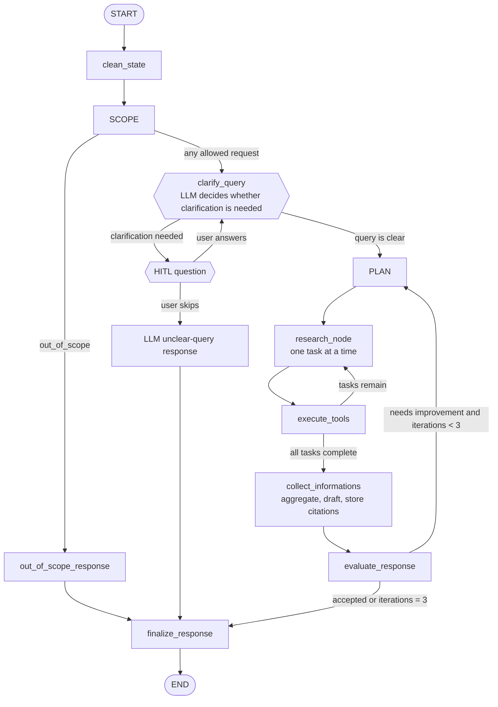

# Research Agent

Research Agent is a research-focused assistant that combines LLM-based planning with a local document retrieval pipeline. The project supports evidence-based research questions, optional document grounding, and hybrid retrieval over uploaded files and external sources.

## Current RAG Implementation

The active document pipeline is the refactored update package under [research_agent/rag_system_update](research_agent/rag_system_update). The older `research_agent/rag_system/` package remains as a separate legacy implementation and is not the active update path.

The active package keeps responsibilities separated:

- generic validation, persistence, loading, and chunking belong to `DocumentHandler`
- PDF-specific parsing, markdown conversion, TOC handling, title, author, and heading extraction belong to `PDFDocumentHandler`
- indexing and retrieval orchestration belong to `HybridRAG`
- dense retrieval, lexical retrieval, fusion, reranking, and final ranking are separate components
- `RetrievedChunk` and `SearchResults` are the shared Pydantic data types

## Complete Architecture

```text
Input file path
    |
    v
HybridRAG.store_document(file_path)
    |
    +--> documents/<session_id>/<filename>
    |       canonical session copy
    |
    +--> DocumentHandler.prepare_file(file_path)
              |
              +--> PDFDocumentHandler for PDF files
              |       +--> pypdf page text and PDF metadata
              |       +--> pymupdf4llm markdown conversion
              |       +--> PyMuPDF outline / TOC headings
              |
              +--> TextLoader for .txt and .md
              +--> Docx2txtLoader for .docx
              +--> python-pptx for .ppt and .pptx
              |
              +--> clean text, attach metadata, split into chunks
    |
    +--> UUID chunk IDs + Hugging Face embeddings
    |       |
    |       +--> Chroma: .chroma/<session_id>
    |       +--> BM25: rebuilt in memory from session documents

Query
    |
    v
HybridRAG.retrieve(query, k)
    |
    +--> dense Chroma candidates
    +--> BM25 lexical candidates
    +--> Reciprocal Rank Fusion
    +--> cross-encoder reranking
    +--> weighted harmonic final ranking
    +--> SearchResults(results=[RetrievedChunk, ...])
```

## Package Layout

```text
research_agent/
├── config.py
├── rag_system/                         legacy implementation
└── rag_system_update/
    ├── __init__.py
    ├── main.py                          interactive CLI checker
    ├── rag_engine.py                    HybridRAG orchestration
    ├── data_types.py                    Pydantic RetrievedChunk/SearchResults
    ├── dense_retriever.py               Chroma and embedding retrieval
    ├── lexical_retriever.py             BM25 retrieval
    ├── rrf_ranker.py                    rank fusion
    ├── cross_encoder_ranker.py          candidate reranking
    ├── overall_ranker.py                final ranking
    ├── document_handler/
    │   ├── __init__.py
    │   ├── document_handler.py          generic loading/storage/chunking
    │   └── pdf_handler.py               PDF parsing and metadata
    ├── Artificial_Intelligence/         benchmark PDF corpus
    └── rag_evaluation_research_papers/  benchmark code and cases
```

## Supported Document Types

The active `DocumentHandler` allows:

- `.pdf`
- `.md`
- `.ppt`
- `.pptx`
- `.docx`
- `.txt`

Anything outside this allowlist is rejected during file preparation.

## Core API

### `HybridRAG`

```python
from research_agent.rag_system_update.rag_engine import HybridRAG

rag = HybridRAG(session_id="my-research-session")
rag.store_document("path/to/paper.pdf")
results = rag.retrieve("What evidence supports the main conclusion?", k=5)
```

The `session_id` isolates both storage namespaces:

- original files: `DOCUMENTS_DIR/<session_id>/`
- vector database: `CHROMA_DIR/<session_id>/`
- Chroma collection: sanitized session-specific collection name

A query never searches another session's collection.

### Ingestion contract

```python
count = rag.store_document(file_path, progress_callback=None)
```

- The RAG API accepts one file path, never a directory.
- Directory expansion belongs only to a CLI or benchmark wrapper.
- An external file is copied into the session directory before parsing.
- Re-uploading the same basename replaces the session file and deletes its old Chroma chunks before re-indexing.
- The return value is the number of chunks indexed.

### Retrieval contract

`HybridRAG.retrieve()` returns a Pydantic `SearchResults` object:

```python
SearchResults(
    results=[
        RetrievedChunk(
            chunk_id="uuid",
            document=Document(...),
            rrf_score=0.02,
            rrf_normalized=0.5,
            similarity_score=0.85,
            cross_encoder_score=0.03,
            cross_encoder_normalized=0.51,
            final_score=0.50,
        )
    ]
)
```

The CLI and benchmark serialize each chunk to this JSON shape:

```json
{
  "content": "retrieved chunk text",
  "metadata": {
    "chunk_id": "uuid",
    "filename": "paper.pdf",
    "source": "paper.pdf",
    "similarity_score": 0.85,
    "title": "Document title",
    "heading": "Current section heading",
    "section_heading": "Current section heading",
    "page_number": "6",
    "authors": ["Author Name"],
    "score": 0.60,
    "rrf_score": 0.02,
    "cross_encoder_score": 0.03
  }
}
```

`chunk_id` is a UUID assigned at storage time and shared by dense and BM25 retrieval so RRF can identify the same chunk.

## Ingestion Details

### Generic document handling

`DocumentHandler.prepare_file()` validates a single path, dispatches by extension, loads LangChain `Document` objects, cleans their text, attaches default source/filename metadata, and calls `generate_chunks()`.

Chunking uses `RecursiveCharacterTextSplitter` with:

- `RAG_CHUNK_SIZE`
- `RAG_CHUNK_OVERLAP`
- paragraph, line, sentence, semicolon, comma, word, and character separators

### PDF handling

`PDFDocumentHandler` processes PDFs page by page using:

1. `pypdf` for page text and embedded metadata
2. `pymupdf4llm.to_markdown(path, use_ocr=False)` for structure-aware markdown
3. PyMuPDF outline/table-of-contents data when available

The parser captures title and authors from PDF metadata when available. Heading and section metadata comes from the document's markdown/outline structure, with page text as a fallback. The filename is a source identifier, not a document title.

Each PDF page receives metadata such as:

- `filename`
- `source`
- `title`
- `heading`
- `section_heading`
- `page_number`
- `authors`, when available

### UUID and replacement behavior

Each stored chunk receives `metadata["chunk_id"] = uuid.uuid4()`. The same UUID is passed to Chroma. Before re-indexing a file, the retriever deletes all chunks whose `filename` matches the incoming basename.

## Retrieval And Ranking

### Dense retrieval

`dense_retriever.py` uses normalized Hugging Face embeddings with LangChain Chroma. Persistent storage is under `CHROMA_DIR/<session_id>`. Dense and lexical retrieval each request up to:

```text
RAG_TOP_K * RAG_CANDIDATE_MULTIPLIER
```

### BM25 lexical retrieval

`lexical_retriever.py` builds an in-memory BM25 index from all documents in the current session's Chroma collection. It is rebuilt after ingestion and when `HybridRAG` starts. It helps with exact names, acronyms, numbers, and terminology.

### Reciprocal Rank Fusion

`rrf_ranker.py` joins dense and BM25 results by UUID. With smoothing value `60`, rank `r` contributes:

$$
\operatorname{RRF}(r) = \frac{1}{60 + r}
$$

The result is normalized against the theoretical maximum score for rank one in both retrievers and passed to the next stage.

### Cross-encoder reranking

`cross_encoder_ranker.py` scores `(query, chunk_text)` pairs only after RRF has reduced the candidate set. Raw scores are converted with a sigmoid into `cross_encoder_normalized`. The model is loaded once at module import and reused. Set `CROSS_ENCODER_ENABLED=false` to disable it.

### Final ranking

`overall_ranker.py` combines `rrf_normalized` and `cross_encoder_normalized` with a weighted harmonic mean. The RRF weight is the sum of `RAG_DENSE_WEIGHT` and `RAG_BM25_WEIGHT`; the cross-encoder weight is `RAG_CROSS_ENCODER_WEIGHT`.

## Configuration

Settings are loaded from `.env` by `research_agent/config.py`.

| Variable | Default | Purpose |
|---|---:|---|
| `DOCUMENTS_DIR` | `documents` | Session file storage root |
| `CHROMA_DIR` | `.chroma` | Persistent Chroma root |
| `EMBEDDING_MODEL_ID` | `BAAI/bge-m3` in shared settings | Embedding model setting |
| `EMBEDDING_CACHE_DIR` | `.models` | Model cache directory |
| `EMBEDDING_LOCAL_FILES_ONLY` | `false` | Disable model downloads |
| `CROSS_ENCODER_MODEL_ID` | `BAAI/bge-reranker-v2-m3` | Cross-encoder model |
| `CROSS_ENCODER_ENABLED` | `true` | Enable cross-encoder |
| `CROSS_ENCODER_BATCH_SIZE` | `8` | Cross-encoder batch size |
| `CROSS_ENCODER_LOCAL_FILES_ONLY` | `false` | Use cached reranker only |
| `CROSS_ENCODER_CACHE_DIR` | `.models` | Cross-encoder cache directory |
| `RAG_CHUNK_SIZE` | `900` | Maximum chunk size |
| `RAG_CHUNK_OVERLAP` | `140` | Chunk overlap |
| `RAG_EMBEDDING_BATCH_SIZE` | `16` | Embedding batch size |
| `RAG_TOP_K` | `8` | Default final result count |
| `LLM_CALL_DELAY_SECONDS` | `20` | Delay before each LLM call |
| `MAX_RETRIES` | `3` | Maximum attempts for retryable operations |
| `RETRY_DELAY_SECONDS` | `1` | Fixed delay between retry attempts |
| `SESSION_MEMORY_SNAPSHOT_DIR` | `session_memory_snapshots` | Diagnostic JSON mirror of per-session RAM memory |

## Session Memory And Conversation Compaction

The runtime memory model is intentionally separated from graph state so long-lived user/session facts do not pollute the workflow state.

### Process-level in-memory session store

The project keeps a single RAM registry keyed by `session_id`:

- each session has its own `ShortTermMemory` instance
- memory is stored in `SESSION_MEMORY_STORE`
- the store is created once per Python process and lives only in memory
- when a session ends or a new session starts, the old entry is removed from RAM

This prevents memory leakage across concurrent sessions. The `ResearchGraph` reads and writes session-scoped memory through the session key instead of storing large memory objects in the graph state.

### Compact durable memory

The memory payload is intentionally small and structured:

- `user_info`: a short deduplicated list of durable facts about the user, such as role, preferences, domain, or constraints
- `session_context`: a short deduplicated list of durable facts about the current research session, such as topic, unresolved questions, or important findings

These are not raw transcripts and not large conversation snapshots. Instead, they are extracted from:

- the latest user query via `update_from_query()`
- the final answer via `update_from_response()`

Each list is maintained with a strict cap and deduplication logic so the memory stays compact and relevant.

### Graph state conversation window

The graph state keeps only recent interaction history and does not store the full long-term transcript.

- maximum of 5 recent user/assistant turns remain in `state["messages"]`
- older turns are removed from the active graph state
- the condensed older context is moved into `state["message_summary"]`

The compaction rule is:

1. append the newest turn to the message list
2. if the list exceeds 5 turns, remove the oldest turns
3. summarize those removed turns into `message_summary`
4. keep only the latest 5 turns in `messages`

This keeps the state lean while preserving the essential context needed for planning and evaluation.

### Prompt integration

Drafting and evaluation both receive the compact memory and summary context:

- `user_info`
- `session_context`
- `message_summary`
- recent conversation window

This allows the model to answer with memory continuity without needing large graph-state history.

### Session lifecycle behavior

The Streamlit app creates a fresh session identifier and clears the old in-RAM memory when a new session begins. This guarantees that the memory for one chat does not bleed into another chat.

For demonstration and inspection, each session also writes a JSON snapshot under `SESSION_MEMORY_SNAPSHOT_DIR` (by default `session_memory_snapshots/`). This is only a diagnostic mirror of `user_info` and `session_context`; the agent never reads it during a request, and runtime memory remains in the process-level RAM store.

In short, the design now follows this pattern:

- short-lived graph state: only recent messages + summary
- long-lived runtime memory: compact per-session facts in RAM only
- session cleanup: remove the memory entry on session end
| `RAG_CANDIDATE_MULTIPLIER` | `6` | Candidate expansion factor |
| `HUGGINGFACEHUB_API_TOKEN1` ... `HUGGINGFACEHUB_API_TOKEN5` | empty | Hugging Face authentication and rate-limit rotation |
| `HF_PROVIDER` | `auto` | Hugging Face provider |
| `RAG_DENSE_WEIGHT` | `0.35` | Dense retrieval contribution |
| `RAG_BM25_WEIGHT` | `0.25` | BM25 retrieval contribution |
| `RAG_CROSS_ENCODER_WEIGHT` | `0.40` | Cross-encoder contribution |
| `MAX_RESEARCH_ITERATIONS` | `2` | Maximum critique iterations |

### Hugging Face Token Rotation

The application reads the numbered variables `HUGGINGFACEHUB_API_TOKEN1` through `HUGGINGFACEHUB_API_TOKEN5` and cycles through the configured tokens when creating LLM clients. If you add or remove token slots, update both the corresponding variables in `.env` and the supported range in `_configured_hf_tokens()` in [research_agent/config.py](research_agent/config.py). Keep `.env` and `.env.example` aligned by variable name, and never commit real token values.

## Running The RAG Pipeline

From the project root:

```powershell
python -m research_agent.rag_system_update.main
```

The current CLI prompts for a query, session ID, and top-k, then prints serialized retrieval results. Its directory discovery/indexing helpers are intended for test workflows; the core RAG API remains single-file.

## Research-Paper Evaluation

The evaluation code is under [research_agent/rag_system_update/rag_evaluation_research_papers](research_agent/rag_system_update/rag_evaluation_research_papers). Its intended source PDFs are under `research_agent/rag_system_update/Artificial_Intelligence/`.

Important files:

- `process_doc_and_query.py`: corpus processing, query execution, scoring, and report writing
- `evaluate_retrieval.py`: source matching and per-query scoring
- `eval_cases.json`: questions, expected source files, and relevant pages
- `eval_cases.jsonl`: alternate JSONL benchmark format
- `eval_results.json`: generated report

Run it with:

```powershell
python -m research_agent.rag_system_update.rag_evaluation_research_papers.process_doc_and_query
```

The evaluator checks whether normalized `source` or `filename` metadata matches the expected source. It reports:

- `precision@k`
- `hits@k`
- `misses@k`
- matched and unmatched result lists

Recall is intentionally not reported because the benchmark does not know the total number of relevant documents in the vector database. The evaluation package uses `HybridRAG` and should not bypass the active ingestion/retrieval engine.

Current implementation note: `process_source_directory()` creates the session RAG engine, but its loop over `Artificial_Intelligence/*.pdf` is currently commented out. Uncomment or restore that loop before expecting a fresh evaluation run to index the benchmark corpus.

## Research Workflow

The broader Research Agent still follows this high-level pattern:

1. classify whether a request is in scope
2. plan a research path when needed
3. select tools and external evidence sources
4. index and query uploaded documents using the RAG pipeline
5. synthesize a final answer with citations and source grounding

The RAG package supplies grounded evidence; the broader agent is responsible for planning, tool use, synthesis, and final response generation.

### Research Graph Flow

The research graph is implemented by `ResearchGraph` in `research_agent/graph.py`. Scope routing sends out-of-scope requests to an LLM-guided response and sends in-scope requests through conditional clarification, planning, sequential task execution, response aggregation, drafting, and evaluation.



Graph state follows the evidence through the workflow:

- `messages` is transient during tool execution and is replaced at finalization with the normalized query and final response.
- `tasks` stores the ordered research tasks; `current_task_index` identifies the task being executed.
- `tool_responses` stores raw tool output records with content and source information.
- `citations` stores the deduplicated citation strings selected by the LLM in `collect_informations`.
- `draft_response` and `evaluation` carry the answer and evaluation results until finalization.
- `final_response` is the user-facing completed response.

### Session Memory

Short-term conversational memory is kept in the in-memory `ShortTermMemory` instance associated with the active session, not in `ResearchState`. `clean_state` starts each run with the session's current context, while `finalize_response` records the completed user/assistant turn and asks the LLM to maintain:

- the last five messages verbatim
- a summary of older conversation
- user preferences
- user information, such as a stated name
- important research points and session topics

That context is supplied to clarification, planning, research, draft-generation, and evaluation prompts. Starting a new Streamlit session creates a fresh memory store.

## Logging

The local pipeline prints progress markers such as:

```text
[RAG][DOCUMENT]       source loading
[RAG][CHUNKING]       chunk creation
[RAG][EMBEDDING]      embedding batches
[RAG][VECTOR STORE]   Chroma writes/deletes
[RAG][BM25]           lexical index state
[RAG][QUERY]          incoming query
[RAG][RETRIEVAL]      dense and lexical counts
[RAG][RRF]            fusion count
[RAG][CROSS ENCODER]  reranking
[RAG][FINAL RANKING]  selected results
```

For production, route these events through structured logging and add latency, model failure, parser failure, empty-result, and candidate-count metrics.

## Production Considerations

- Pin compatible versions of Chroma, LangChain, PyMuPDF, `pymupdf4llm`, `pypdf`, and `sentence-transformers`.
- Decide whether model downloads are allowed; otherwise pre-cache models and enable local-only settings.
- Validate and sanitize session IDs and uploaded filenames.
- Add file-size, page-count, timeout, and memory limits for PDF parsing.
- Enable an explicit OCR path for scanned PDFs; the current markdown conversion uses `use_ocr=False`.
- Add concurrency control around same-file replacement and simultaneous writes.
- Rebuild BM25 consistently after process restarts, as the current implementation does from session Chroma documents.
- Add tests for session isolation, overwrite behavior, UUID stability, malformed PDFs, empty documents, and unavailable models.
- Evaluate content relevance in addition to filename matching before relying on benchmark scores for release decisions.

## Notes

- The project keeps document parsing and retrieval logic separate.
- The document loader is intentionally strict about file types.
- The PDF handler is the only file-type-specific branch in the current update structure.
- The legacy `rag_system` package remains available as a reference but should not be treated as the active implementation unless intentionally selected.
