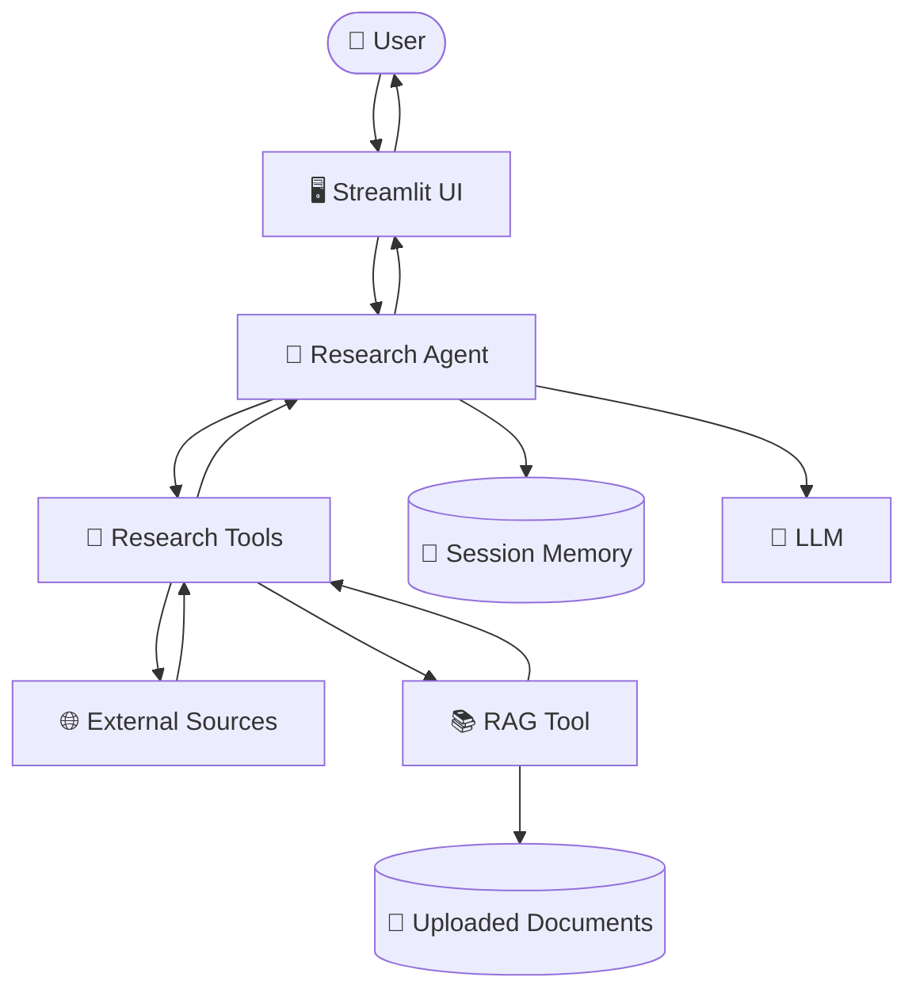
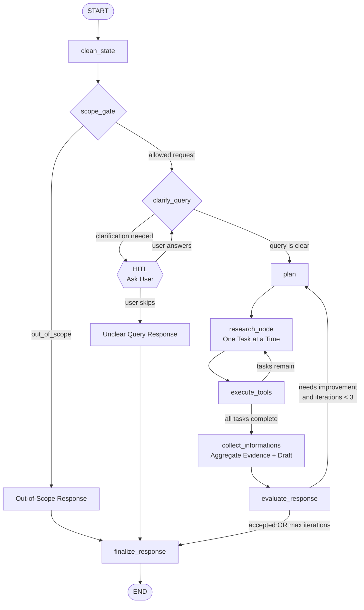
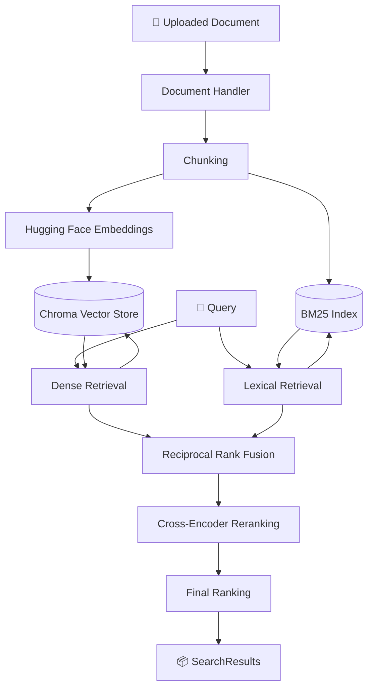
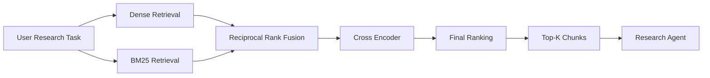
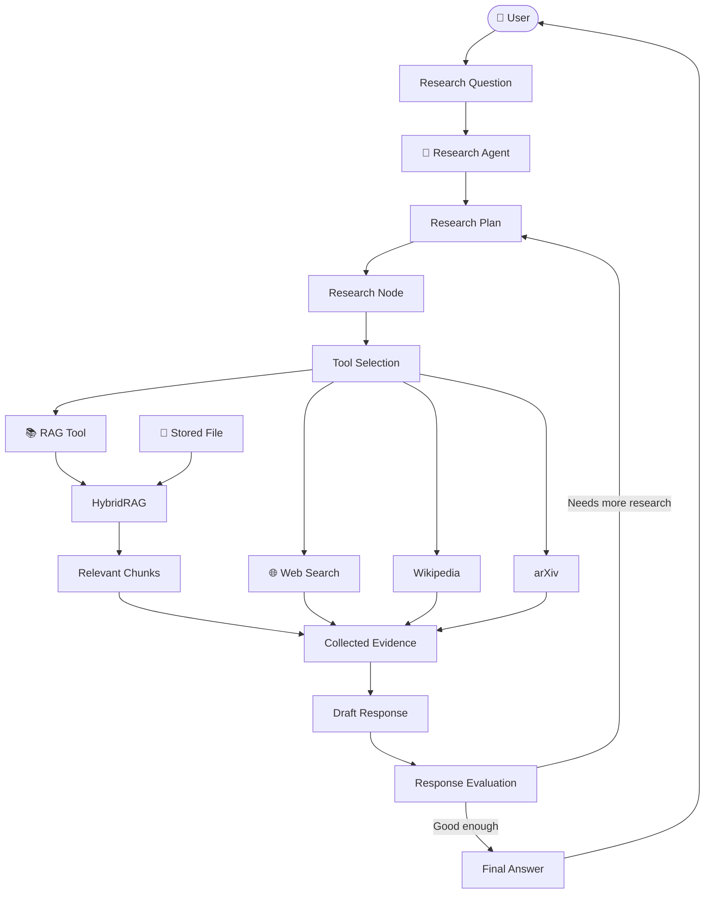
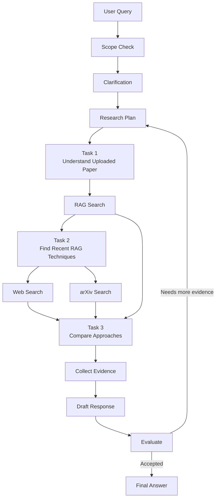

# 🔬 Research Agent

> An evidence-focused AI research assistant that plans research tasks, selects appropriate tools, gathers information from multiple sources, evaluates the gathered evidence, and produces a grounded final response.

<p align="center">

**🧠 Planning   •   🔧 Tool Use   •   📚 RAG   •   🔄 Reflection   •   👤 Human-in-the-Loop   •   💾 Session Memory**

</p>

---

## 📖 Table of Contents

* [1. Overview](#1-overview)
* [2. What Problem Does This Solve?](#2-what-problem-does-this-solve)
* [3. Key Features](#3-key-features)
* [4. How the System Works](#4-how-the-system-works)

  * [4.1 High-Level Architecture](#41-high-level-architecture)
  * [4.2 Agent vs RAG](#42-agent-vs-rag)
* [5. Research Graph](#5-research-graph)

  * [5.1 Complete Research Graph Flow](#51-complete-research-graph-flow)
  * [5.2 Step-by-Step Explanation](#52-step-by-step-explanation)
  * [5.3 Research Iteration Loop](#53-research-iteration-loop)
* [6. Agent Components](#6-agent-components)

  * [6.1 Scope Gate](#61-scope-gate)
  * [6.2 Clarification / HITL](#62-clarification--hitl)
  * [6.3 Planning](#63-planning)
  * [6.4 Research Node](#64-research-node)
  * [6.5 Tool Execution](#65-tool-execution)
  * [6.6 Information Collection](#66-information-collection)
  * [6.7 Response Evaluation](#67-response-evaluation)
  * [6.8 Finalization](#68-finalization)
* [7. Tools Available to the Agent](#7-tools-available-to-the-agent)
* [8. RAG System](#8-rag-system)

  * [8.1 What RAG Does](#81-what-rag-does)
  * [8.2 RAG Architecture](#82-rag-architecture)
  * [8.3 Document Ingestion](#83-document-ingestion)
  * [8.4 Retrieval Pipeline](#84-retrieval-pipeline)
  * [8.5 Dense Retrieval](#85-dense-retrieval)
  * [8.6 BM25 Retrieval](#86-bm25-retrieval)
  * [8.7 Reciprocal Rank Fusion](#87-reciprocal-rank-fusion)
  * [8.8 Cross-Encoder Reranking](#88-cross-encoder-reranking)
  * [8.9 Final Ranking](#89-final-ranking)
* [9. Complete Agent + RAG Interaction](#9-complete-agent--rag-interaction)
* [10. Session Memory](#10-session-memory)
* [11. Streamlit Application](#11-streamlit-application)
* [12. Project Structure](#12-project-structure)
* [13. Important Files](#13-important-files)
* [14. Technology Stack](#14-technology-stack)
* [15. Installation](#15-installation)
* [16. Environment Configuration](#16-environment-configuration)
* [17. Running the Application](#17-running-the-application)
* [18. Using Document RAG](#18-using-document-rag)
* [19. Example Research Flow](#19-example-research-flow)
* [20. Data Flow](#20-data-flow)
* [21. Error Handling and Reliability](#21-error-handling-and-reliability)
* [22. Logging](#22-logging)
* [23. Design Principles](#23-design-principles)
* [24. Limitations and Notes](#24-limitations-and-notes)
* [25. Future Improvements](#25-future-improvements)
* [26. License](#26-license)

---

# 1. Overview

**Research Agent** is an AI-powered research system designed to answer research-oriented questions by combining:

* Large Language Models (LLMs)
* Structured research planning
* Multiple external and local tools
* Document-based RAG
* Session memory
* Human-in-the-loop clarification
* Evidence collection
* Response evaluation
* Citation/source grounding

The important idea is that this project is **not simply a chatbot** and **not simply a RAG application**.

The central component is the **Research Agent**.

The agent decides:

> **What should I research? → How should I break it down? → Which tool should I use? → Do I have enough evidence? → Should I research more? → What should the final answer contain?**

RAG is one of the tools available to the agent when the answer requires information from documents uploaded by the user.

---

# 2. What Problem Does This Solve?

A normal LLM can answer a question directly:

```text
User
  ↓
LLM
  ↓
Answer
```

But this approach has limitations:

* The model may not have the required information.
* The question may require multiple sources.
* The question may be too broad.
* Important details may exist inside uploaded documents.
* A single answer generation step may not be enough.
* The model may need to verify whether its answer is sufficiently supported.

This project instead uses a research workflow:

```text
                         ┌─────────────────┐
                         │   User Query    │
                         └────────┬────────┘
                                  ↓
                         ┌─────────────────┐
                         │ Research Agent  │
                         └────────┬────────┘
                                  ↓
                         Understand Question
                                  ↓
                           Create Research Plan
                                  ↓
                       Select Appropriate Tools
                                  ↓
                    ┌─────────────┼─────────────┐
                    ↓             ↓             ↓
                 Web Search      RAG         arXiv / Wiki
                    │             │             │
                    └─────────────┼─────────────┘
                                  ↓
                         Collect Evidence
                                  ↓
                           Draft Response
                                  ↓
                         Evaluate Response
                                  ↓
                     ┌────────────┴────────────┐
                     │                         │
               Needs more work?              No
                     │                         │
                    Yes                       ↓
                     │                  Final Response
                     └──────→ Research
```

This makes the system **agentic** because the LLM participates in deciding what actions should happen next.

---

# 3. Key Features

## 🧠 Intelligent Research Planning

The agent does not necessarily research the original question as one large task.

The planner breaks the question into smaller research tasks.

For example:

```text
User:
"How does RAG compare with fine-tuning for enterprise applications?"

                 ↓

Research Plan

Task 1 → Understand RAG
Task 2 → Understand fine-tuning
Task 3 → Compare advantages
Task 4 → Compare limitations
Task 5 → Analyze enterprise use cases
```

The agent then executes these tasks sequentially.

---

## 🔧 Multiple Research Tools

The agent can choose between different tools depending on the research requirement.

Current tools include:

* `web_search`
* `rag_search`
* `read_stored_file`
* `list_stored_files`
* `wikipedia_search`
* `arxiv_search`

The LLM is responsible for selecting appropriate tools for the current research task.

---

## 📚 Document-Based RAG

Users can upload documents such as:

* PDF
* DOCX
* TXT
* Markdown
* CSV
* JSON
* HTML
* XML
* Python files
* XLSX
* PPTX

The Streamlit interface accepts these uploads and sends them through the document indexing pipeline.

The RAG system then:

```text
Document
   ↓
Load
   ↓
Clean
   ↓
Chunk
   ↓
Embedding
   ↓
Chroma Vector Store
   +
BM25 Index
```

When the agent decides that local documents are useful:

```text
Research Task
     ↓
rag_search
     ↓
HybridRAG
     ↓
Relevant document chunks
     ↓
Agent
```

---

## 👤 Human-in-the-Loop

If the research question is unclear, the agent can stop and ask the user for clarification.

For example:

```text
User:
"Research Apple."

Agent:
"Which aspect of Apple would you like me to research?
Products, financial performance, history, or recent developments?"
```

The user's answer is then fed back into the graph.

---

## 🔄 Response Evaluation

The agent does not immediately finalize every research result.

After collecting evidence and creating a draft, the system evaluates the response.

If improvement is required:

```text
Evaluation
    ↓
Needs improvement
    ↓
Back to Planning
    ↓
Additional research
    ↓
New draft
```

The graph allows bounded iterative improvement rather than an unlimited loop.

---

## 💾 Session Memory

Each research session has its own memory.

The memory stores compact information such as:

* user information
* user preferences
* session context
* important research findings
* recent conversation
* summarized older conversation

The system also keeps the graph state relatively small by maintaining a limited recent conversation window and summarizing older turns.

---

# 4. How the System Works

## 4.1 High-Level Architecture

The entire system can be understood as five major layers:



### The important relationship

```text
                         RESEARCH AGENT
                               │
            ┌──────────────────┼──────────────────┐
            │                  │                  │
            ▼                  ▼                  ▼
          LLM               Tools             Memory
                               │
              ┌────────────────┼────────────────┐
              │        │       │       │        │
              ▼        ▼       ▼       ▼        ▼
             Web      RAG    Wiki    arXiv    Files
                      │
                      ▼
                  Documents
```

**RAG is inside the tool layer.**

It is not the entire agent.

---

# 4.2 Agent vs RAG

This distinction is important.

## Research Agent

The **agent** is responsible for:

* understanding the request
* deciding whether the request is relevant to research
* asking for clarification
* creating a research plan
* selecting tools
* executing research tasks
* collecting evidence
* creating a draft
* evaluating the draft
* deciding whether more research is necessary
* producing the final answer

---

## RAG

RAG is responsible for:

* loading documents
* processing documents
* chunking documents
* generating embeddings
* storing chunks
* retrieving relevant chunks
* combining dense and lexical retrieval
* reranking results
* returning evidence to the agent

Therefore:

```text
                 Research Agent
                       │
        ┌──────────────┼──────────────┐
        │              │              │
     Web Tool       RAG Tool       arXiv Tool
                       │
                ┌──────┴──────┐
                │             │
             Chroma          BM25
                │             │
                └──────┬──────┘
                       │
                  Reranking
                       │
                 RAG Results
                       │
                       ▼
                 Research Agent
```

---

# 5. Research Graph

The core agent workflow is implemented by:

```text
research_agent/graph.py
```

`ResearchGraph` creates a LangGraph `StateGraph` containing the major research nodes and their conditional transitions.

The graph contains:

```text
clean_state
scope_gate
out_of_scope_response
clarify_query
plan
research_node
execute_tools
collect_informations
evaluate_response
finalize_response
```

---

# 5.1 Complete Research Graph Flow

> **This is the current Research Graph Flow. The routing below follows the graph implementation and should be treated as the authoritative agent workflow.**



The actual graph implementation defines the same major transitions: `clean_state → scope_gate`, scope routing, clarification routing, `plan → research_node → execute_tools`, sequential task looping, information collection, evaluation, bounded re-planning, and finalization.

---

# 5.2 Step-by-Step Explanation

## Step 1 — `clean_state`

The workflow starts by preparing the state for the current research request.

It makes sure the current query and session context are ready for the graph.

```text
START
  ↓
clean_state
```

---

## Step 2 — `scope_gate`

The agent first determines whether the request belongs to the intended research scope.

```text
                 scope_gate
                    │
          ┌─────────┴─────────┐
          │                   │
     Out of scope          Allowed
          │                   │
          ▼                   ▼
 out_of_scope_response   clarify_query
```

The scope decision is LLM-based and produces a structured classification.

---

## Step 3 — `out_of_scope_response`

If the request is outside the intended research scope, the system generates an appropriate response instead of running the complete research pipeline.

```text
scope_gate
    ↓
out_of_scope_response
    ↓
finalize_response
    ↓
END
```

---

## Step 4 — `clarify_query`

For allowed requests, the system checks whether the research question is sufficiently clear.

```text
clarify_query
      │
      ├── Clear ─────────→ plan
      │
      └── Unclear ───────→ HITL
```

The clarification node can also incorporate the user's clarification answer and construct a better final research query.

---

## Step 5 — Human-in-the-Loop

If the question is unclear, the graph can pause and ask the user for clarification.

```text
        ┌───────────────┐
        │ clarify_query │
        └───────┬───────┘
                │
         needs clarification
                ↓
        ┌───────────────┐
        │      HITL     │
        │ Ask the user  │
        └───────┬───────┘
                │
             answer
                ↓
        clarify_query
```

This makes the research process interactive instead of forcing the model to guess the user's intent.

---

# 5.3 Research Iteration Loop

Once the query is clear, the agent creates a plan.

```text
PLAN
 ↓
RESEARCH NODE
 ↓
TOOLS
 ↓
more tasks?
 ├── YES → RESEARCH NODE
 └── NO  → COLLECT
```

After collecting the evidence:

```text
COLLECT
   ↓
EVALUATE
   │
   ├── Needs improvement → PLAN
   │
   └── Good enough       → FINALIZE
```

The graph also contains a maximum iteration safeguard, preventing the evaluation loop from continuing indefinitely. The current graph routes to finalization once the configured iteration boundary is reached.

---

# 6. Agent Components

## 6.1 Scope Gate

**File:**

```text
research_agent/nodes.py
```

Purpose:

> Determine whether the user request belongs to the intended research domain.

The node asks the LLM for a structured `ScopeDecision`.

This prevents unrelated requests from unnecessarily entering the research workflow.

---

## 6.2 Clarification / HITL

Purpose:

> Determine whether the research question is clear enough to research.

If necessary:

```text
Agent
  ↓
Question is unclear
  ↓
Ask user
  ↓
User provides clarification
  ↓
Agent updates query
```

The clarification response is incorporated into the research query before planning.

---

## 6.3 Planning

The `plan` node creates a structured research plan.

Conceptually:

```text
Research Question
       ↓
     Planner
       ↓
 ┌─────┼─────┬─────┐
 ↓     ↓     ↓     ↓
Task1 Task2 Task3 Task4
```

The planner receives information such as:

* current query
* previous draft
* previous evaluation
* session context
* recent conversation
* user information

The resulting tasks are then executed one at a time.

---

## 6.4 Research Node

The `research_node` decides which tools should be used for the current research task.

It receives:

* original research query
* current task
* available tools
* session memory
* recent conversation
* summarized context

The LLM produces structured tool selections.

Conceptually:

```text
Current Task
     ↓
Research Node
     ↓
Which tool is useful?
     │
 ┌───┼──────┬────────┐
 ↓   ↓      ↓        ↓
Web  RAG  Wikipedia arXiv
```

The implementation constructs tool calls from the LLM's structured selection and validates them against the tools actually available to the graph.

---

## 6.5 Tool Execution

The selected tools are executed by the graph's tool execution stage.

```text
research_node
      ↓
execute_tools
      ↓
Tool results
      ↓
Research state
```

If the current plan still contains unfinished tasks:

```text
execute_tools
      ↓
next task
      ↓
research_node
```

Otherwise:

```text
execute_tools
      ↓
collect_informations
```

---

## 6.6 Information Collection

Once all planned tasks have been completed, the system gathers the tool outputs.

The collection stage:

1. gathers source/tool responses
2. identifies research evidence
3. processes citations
4. creates a draft answer
5. prepares information for evaluation

The implementation also merges citations and produces a draft response at this stage.

---

## 6.7 Response Evaluation

The draft is then evaluated.

Conceptually:

```text
              Draft
                ↓
          Evaluation
                ↓
       ┌────────┴────────┐
       │                 │
   Good enough       Needs work
       │                 │
       ▼                 ▼
   Finalize             Plan
                         ↓
                   More research
```

The evaluation determines whether additional research is necessary.

---

## 6.8 Finalization

The finalization stage creates the user-facing response.

At this point the agent has:

* the research query
* research tasks
* gathered evidence
* citations
* draft response
* evaluation information
* session context

The final result is returned to the Streamlit interface.

---

# 7. Tools Available to the Agent

The current research tool layer provides six main tools.

| Tool                | Purpose                                        |
| ------------------- | ---------------------------------------------- |
| `web_search`        | Search the web for current/general information |
| `rag_search`        | Search uploaded/stored documents               |
| `read_stored_file`  | Read a known stored document                   |
| `list_stored_files` | Discover available uploaded files              |
| `wikipedia_search`  | Background information and definitions         |
| `arxiv_search`      | Academic and technical research                |

---

## Tool Selection Concept

The agent does not have to use every tool.

For example:

### Question

```text
"What does this uploaded research paper say about transformers?"
```

Likely useful:

```text
rag_search
```

---

### Question

```text
"What happened in AI research this week?"
```

Likely useful:

```text
web_search
```

---

### Question

```text
"What does recent academic literature say about RAG evaluation?"
```

Likely useful:

```text
arxiv_search
```

---

### Question

```text
"What is reinforcement learning?"
```

Likely useful:

```text
wikipedia_search
```

The agent chooses based on the research task rather than blindly calling every tool.

---

# 8. RAG System

RAG stands for:

> **Retrieval-Augmented Generation**

In this project, RAG is **not the main agent**.

It is a specialized research tool used when the agent needs evidence from locally uploaded documents.

---

# 8.1 What RAG Does

Suppose the user uploads:

```text
research_paper.pdf
```

and asks:

```text
"What does the paper say about the limitations of the proposed method?"
```

Instead of giving the entire PDF to the LLM, the RAG system finds the most relevant portions.

```text
PDF
 ↓
Text Extraction
 ↓
Chunking
 ↓
Embeddings
 ↓
Chroma

Question
 ↓
Dense Search ─────┐
                  ├──→ Fusion → Reranking → Top Results
Question          │
 ↓                │
BM25 Search ──────┘
```

The selected chunks are then returned to the agent.

---

# 8.2 RAG Architecture

The RAG system is implemented around `HybridRAG`.

Its major components are:



`HybridRAG` orchestrates document ingestion and retrieval while the individual retrievers/rankers remain separate components.

---

# 8.3 Document Ingestion

When a document is uploaded:

```text
Uploaded File
     ↓
DocumentHandler
     ↓
Validate File
     ↓
Load Content
     ↓
Clean Text
     ↓
Attach Metadata
     ↓
Split into Chunks
     ↓
Generate Embeddings
     ↓
Store in Chroma
     ↓
Rebuild BM25
```

The RAG pipeline stores documents within a session-specific namespace.

This means different research sessions can maintain separate document stores.

---

## Chunking

Large documents are divided into smaller chunks.

For example:

```text
Large PDF
│
├── Chunk 1
├── Chunk 2
├── Chunk 3
├── Chunk 4
└── ...
```

The project uses recursive character-based chunking with configurable chunk size and overlap. The current shared configuration uses a default chunk size of `900` and overlap of `140`.

---

# 8.4 Retrieval Pipeline

When `rag_search` is called:



The actual `HybridRAG.retrieve()` implementation performs dense and BM25 retrieval in parallel, fuses the results with RRF, reranks the fused candidates using the cross encoder, and performs final ranking.

---

# 8.5 Dense Retrieval

Dense retrieval converts text into vectors.

For example:

```text
"How does attention work?"
            ↓
       Embedding Model
            ↓
[0.12, -0.42, 0.73, ...]
```

The same process is applied to document chunks.

The system then compares:

```text
Query Vector
      ↓
Vector Similarity
      ↓
Most Similar Chunks
```

The repository uses Hugging Face embeddings with Chroma as the persistent vector store.

---

# 8.6 BM25 Retrieval

Dense retrieval is good at understanding semantic similarity.

However, exact keyword matching is also important.

For example:

```text
Query:
"GPT-4o"

Document:
"GPT-4o"
```

A lexical system can strongly match the exact term.

The project uses **BM25** for lexical retrieval.

BM25 is useful for:

* exact names
* acronyms
* technical terms
* numbers
* identifiers
* terminology

The BM25 index is maintained in memory and rebuilt after document ingestion and when the RAG engine starts.

---

# 8.7 Reciprocal Rank Fusion

The dense and BM25 systems produce two ranked lists.

Example:

```text
Dense Retrieval:

1. Chunk A
2. Chunk C
3. Chunk B
4. Chunk D


BM25:

1. Chunk C
2. Chunk A
3. Chunk D
4. Chunk B
```

The system combines these rankings using **Reciprocal Rank Fusion (RRF)**.

The implementation uses:

```text
RRF(r) = 1 / (60 + r)
```

where `r` is the rank of the result.

A document that appears highly in both retrieval systems receives stronger combined evidence.

---

# 8.8 Cross-Encoder Reranking

After RRF reduces the candidate set, the system performs a more expensive relevance check.

The cross encoder receives:

```text
(Query, Document Chunk)
```

For example:

```text
(
  "What are the limitations of RAG?",
  "RAG systems can suffer from retrieval errors..."
)
```

The model produces a relevance score.

This stage is more focused than the initial retrieval stage because it works on a smaller candidate set.

The project uses a Sentence Transformers cross encoder and converts its score into a normalized value before final ranking.

---

# 8.9 Final Ranking

The final ranker combines:

```text
RRF score
+
Cross-encoder score
```

using a weighted harmonic mean.

The important idea is:

> A result should perform reasonably well across the retrieval signals instead of being highly ranked by only one signal.

The current `OverallRanker` uses the normalized RRF and cross-encoder scores to produce the final score and select the top results.

---

# 9. Complete Agent + RAG Interaction

This is the most important architectural relationship in the project.



### In one sentence:

> **The Research Agent decides what to do; RAG is one of the tools it can use to obtain evidence.**

---

# 10. Session Memory

The project maintains session-specific memory.

The memory system is intentionally separated from the main graph state.

## Memory contains

### User information

Examples:

```text
User role
User preferences
User constraints
```

### Session context

Examples:

```text
Current research topic
Important findings
Unresolved questions
Research context
```

---

## Conversation Compaction

The graph does not keep an unlimited transcript.

Instead:

```text
Recent messages
      ↓
Keep recent window
      ↓
Older messages
      ↓
Summarize
      ↓
message_summary
```

This keeps the graph state smaller while preserving useful context.

The current design keeps a maximum recent conversation window and summarizes older turns.

---

## Session Isolation

Each Streamlit research session receives its own:

```text
session_id
```

The session ID is used to isolate:

* memory
* document storage
* Chroma storage
* research state

This prevents information from one session from unintentionally appearing in another.

The Streamlit application creates a new session ID when starting a new session and clears the old in-memory session memory.

---

# 11. Streamlit Application

The user-facing application is:

```text
app.py
```

The application provides:

* research chat interface
* session management
* document upload
* document indexing progress
* research progress
* assistant responses
* clarification interaction

The application initializes:

```text
Session ID
    ↓
Session Memory
    ↓
Document Handler
    ↓
HybridRAG
    ↓
ResearchGraph
```

When a question is submitted:

```text
Streamlit
    ↓
ResearchGraph.invoke()
    ↓
Research Graph
    ↓
Final Response
    ↓
Streamlit
```

The current application constructs the `ResearchGraph` with the session's RAG engine, document handler, memory, and session ID.

---

# 12. Project Structure

The repository is organized around the agent core, supporting components, and RAG subsystem.

```text
research_agent/
│
├── app.py
│
├── requirements.txt
├── .env.example
├── README.md
│
├── research_agent/
│   │
│   ├── __init__.py
│   ├── config.py
│   ├── graph.py
│   ├── nodes.py
│   ├── state.py
│   ├── tools.py
│   ├── llm.py
│   ├── memory.py
│   ├── prompts.py
│   ├── parsers.py
│   ├── node_helpers.py
│   └── utils.py
│
│   └── rag_system/
│       │
│       ├── __init__.py
│       ├── rag_engine.py
│       ├── data_types.py
│       ├── dense_retriever.py
│       ├── lexical_retriever.py
│       ├── rrf_ranker.py
│       ├── cross_encoder_ranker.py
│       ├── overall_ranker.py
│       │
│       └── document_handler/
│           ├── __init__.py
│           ├── document_handler.py
│           └── pdf_handler.py
│
├── tests/
│
├── documents/
│
├── .chroma/
│
└── session_memory_snapshots/
```

> The exact repository can contain additional test/benchmark/helper files; the structure above focuses on the core runtime architecture.

---

# 13. Important Files

| File                      | Responsibility                            |
| ------------------------- | ----------------------------------------- |
| `app.py`                  | Streamlit user interface                  |
| `graph.py`                | Builds and runs the research graph        |
| `nodes.py`                | Implements research graph node logic      |
| `state.py`                | Defines graph state                       |
| `tools.py`                | Defines research tools                    |
| `llm.py`                  | LLM construction/invocation               |
| `memory.py`               | Session memory                            |
| `prompts.py`              | System/task prompts                       |
| `parsers.py`              | Structured LLM output parsing             |
| `node_helpers.py`         | Shared research/drafting/citation helpers |
| `config.py`               | Environment-based configuration           |
| `utils.py`                | Logging/retry/helper utilities            |
| `rag_engine.py`           | RAG orchestration                         |
| `dense_retriever.py`      | Embedding/vector retrieval                |
| `lexical_retriever.py`    | BM25 retrieval                            |
| `rrf_ranker.py`           | Dense + lexical fusion                    |
| `cross_encoder_ranker.py` | Candidate reranking                       |
| `overall_ranker.py`       | Final result ranking                      |
| `data_types.py`           | RAG result data models                    |
| `document_handler.py`     | Document loading/chunking                 |
| `pdf_handler.py`          | PDF-specific processing                   |

---

# 14. Technology Stack

## Core

* Python
* LangGraph
* LangChain
* Pydantic
* Streamlit

## LLM

* Hugging Face / configured LLM provider

The default configuration includes a Hugging Face model configuration and supports multiple Hugging Face token slots for authentication/rate-limit rotation.

## Research Tools

* DuckDuckGo Search
* Wikipedia
* arXiv

## RAG

* Hugging Face embeddings
* Chroma
* BM25
* Sentence Transformers Cross Encoder

## Document Processing

* PyPDF
* PyMuPDF / `pymupdf4llm`
* LangChain document loaders
* python-pptx
* DOCX/text/structured-file loaders as configured

---

# 15. Installation

## 15.1 Clone the Repository

```bash
git clone https://github.com/anirban2005143a/research_agent.git

cd research_agent
```

---

## 15.2 Create a Virtual Environment

### Windows

```bash
python -m venv .venv

.venv\Scripts\activate
```

### Linux / macOS

```bash
python3 -m venv .venv

source .venv/bin/activate
```

---

## 15.3 Install Dependencies

```bash
pip install -r requirements.txt
```

The repository maintains its Python dependencies in `requirements.txt`.

---

# 16. Environment Configuration

Create:

```text
.env
```

from:

```text
.env.example
```

The configuration is loaded by `research_agent/config.py`.

Example:

```env
LLM_MODEL_ID=meta-llama/Llama-3.1-8B-Instruct

EMBEDDING_MODEL_ID=BAAI/bge-m3

EMBEDDING_CACHE_DIR=.models

DOCUMENTS_DIR=documents

CHROMA_DIR=.chroma

RAG_CHUNK_SIZE=900

RAG_CHUNK_OVERLAP=140

RAG_TOP_K=8

RAG_EMBEDDING_BATCH_SIZE=16

CROSS_ENCODER_ENABLED=true

CROSS_ENCODER_BATCH_SIZE=8

MAX_RETRIES=3

RETRY_DELAY_SECONDS=1
```

---

## Hugging Face Authentication

The project supports multiple token variables:

```env
HUGGINGFACEHUB_API_TOKEN1=...
HUGGINGFACEHUB_API_TOKEN2=...
HUGGINGFACEHUB_API_TOKEN3=...
HUGGINGFACEHUB_API_TOKEN4=...
HUGGINGFACEHUB_API_TOKEN5=...
```

Only configured tokens are used.

**Never commit real API tokens to GitHub.**

The configuration code explicitly reads the numbered token slots and removes empty/default placeholder values.

---

# 17. Running the Application

From the project root:

```bash
streamlit run app.py
```

The Streamlit interface will provide:

```text
Research Agent
│
├── Research workspace
├── Session ID
├── Document upload
└── Research chat
```

---

# 18. Using Document RAG

## Step 1 — Start the application

```bash
streamlit run app.py
```

---

## Step 2 — Upload documents

Use:

```text
Upload source documents
```

The application accepts multiple files.

---

## Step 3 — Wait for indexing

The application processes each document:

```text
Save
 ↓
Parse
 ↓
Chunk
 ↓
Embed
 ↓
Store
 ↓
BM25 rebuild
```

The UI displays indexing progress.

---

## Step 4 — Ask a question

For example:

```text
What are the main limitations discussed in the uploaded paper?
```

The agent can decide to use:

```text
rag_search
```

---

## Step 5 — RAG returns evidence

```text
Question
   ↓
rag_search
   ↓
HybridRAG
   ↓
Dense + BM25
   ↓
RRF
   ↓
Cross Encoder
   ↓
Final Ranking
   ↓
Relevant Chunks
```

---

## Step 6 — Agent uses the evidence

The returned chunks become part of the agent's research evidence.

```text
RAG Evidence
      +
Web Evidence
      +
arXiv Evidence
      +
Wikipedia Evidence
      ↓
Collected Research
```

The agent can therefore combine local document evidence with external research.

---

# 19. Example Research Flow

Suppose the user asks:

```text
"Compare the approach described in my uploaded paper with recent RAG techniques."
```

The complete process can look like:



This illustrates the important concept:

> The agent controls the research process, while RAG is only one research capability.

---

# 20. Data Flow

There are two major data flows in the system.

---

## 20.1 Research Query Flow

```text
User Question
      ↓
Streamlit
      ↓
ResearchGraph
      ↓
State Preparation
      ↓
Scope Check
      ↓
Clarification
      ↓
Planning
      ↓
Research Task
      ↓
Tool Selection
      ↓
Tool Execution
      ↓
Evidence
      ↓
Collection
      ↓
Draft
      ↓
Evaluation
      ↓
Finalization
      ↓
User
```

---

## 20.2 Document Flow

```text
Uploaded Document
      ↓
Document Handler
      ↓
Text Extraction
      ↓
Cleaning
      ↓
Metadata
      ↓
Chunking
      ↓
Embeddings
      ↓
Chroma

             +
             
BM25 Index
```

Then during retrieval:

```text
Research Task
      ↓
RAG Tool
      ↓
HybridRAG
      │
      ├──────────────→ Dense Retrieval
      │
      └──────────────→ BM25 Retrieval
                            │
                            ↓
                     RRF Fusion
                            ↓
                    Cross Encoder
                            ↓
                    Final Ranking
                            ↓
                     Top-K Chunks
                            ↓
                       RAG Tool
                            ↓
                    Research Agent
```

---

# 21. Error Handling and Reliability

The project contains retry mechanisms around external/tool operations.

For example:

```text
Tool Call
   ↓
Attempt
   ↓
Failure?
 ┌─┴─┐
No  Yes
│    │
↓    ↓
Done Retry
      │
      └──→ Retry limit
```

The configuration provides:

```env
MAX_RETRIES=3
RETRY_DELAY_SECONDS=1
```

The tool layer uses retry handling around operations such as web search, RAG retrieval, file operations, Wikipedia, and arXiv.

---

# 22. Logging

The project contains logging/progress markers for important operations.

Typical RAG stages include:

```text
[RAG][DOCUMENT]
[RAG][CHUNKING]
[RAG][EMBEDDING]
[RAG][VECTOR STORE]
[RAG][BM25]
[RAG][QUERY]
[RAG][RETRIEVAL]
[RAG][RRF]
[RAG][CROSS ENCODER]
[RAG][FINAL RANKING]
```

These make it easier to understand what the RAG system is doing internally.

---

# 23. Design Principles

## 23.1 Agent First

The Research Agent is the central system.

RAG is a tool.

```text
                 Research Agent
                       │
          ┌────────────┼────────────┐
          ↓            ↓            ↓
        Web           RAG         arXiv
        Tool          Tool         Tool
```

---

## 23.2 Tool Specialization

Each tool has a specific purpose.

```text
Web Search     → External/current information

RAG            → Uploaded documents

Wikipedia      → Background/definitions

arXiv          → Academic research

File Reader    → Inspect a known document
```

This avoids treating every information source as the same.

---

## 23.3 Structured Agent State

The workflow is represented using structured graph state rather than passing arbitrary strings between every component.

Important state information includes:

```text
query
tasks
current_task_index
tool_responses
citations
draft_response
evaluation
final_response
```

This makes the research process explicit and inspectable.

---

## 23.4 Bounded Iteration

The evaluation loop is bounded.

```text
Research
   ↓
Draft
   ↓
Evaluate
   ↓
Improve
   ↓
Research again
```

but it cannot continue forever.

---

## 23.5 Session Isolation

Research sessions maintain separate:

* session memory
* documents
* vector storage

This prevents unrelated sessions from sharing research context.

---

# 24. Limitations and Notes

## External Search Dependency

Web, Wikipedia, and arXiv tools depend on external services.

Failures can occur because of:

* network issues
* service availability
* rate limits
* empty search results

---

## Model Dependency

The quality of:

* planning
* tool selection
* clarification
* drafting
* evaluation

depends heavily on the configured LLM.

---

## RAG Dependency

RAG quality depends on:

* document quality
* text extraction
* chunking
* embedding quality
* BM25 retrieval
* reranking
* metadata quality

---

## Scanned PDFs

PDFs containing scanned images may require OCR.

The current PDF processing path does not automatically enable OCR in the markdown conversion path.

---

## Large Documents

Very large document collections may require additional:

* storage management
* batching
* concurrency control
* memory optimization
* retrieval optimization

---

# 25. Future Improvements

Possible future improvements include:

### 🔍 Better Source Verification

Add stronger source-quality and evidence verification.

### 🧠 Better Planning

Allow the planner to dynamically adjust the number and type of research tasks.

### 📊 Research Metrics

Track:

* tool latency
* retrieval latency
* number of sources
* retrieval quality
* iteration count
* token usage
* failed tool calls

### 🗂️ Better Document Management

Add:

* document deletion
* document metadata management
* document preview
* source filtering
* document collections

### 🔎 Better RAG Evaluation

Evaluate:

* retrieval precision
* recall
* MRR
* NDCG
* answer faithfulness
* citation correctness

### 🌐 More Research Sources

Potential future tools:

* Google Scholar
* Semantic Scholar
* PubMed
* official documentation search
* specialized domain databases

---

# 26. License

See the repository license file for licensing information.

---

# 🧠 Quick Mental Model

If you are new to the project, remember the system using this simple hierarchy:

```text
                         ┌──────────────────────┐
                         │    RESEARCH AGENT    │
                         │                      │
                         │  Understands problem │
                         │  Plans research      │
                         │  Chooses tools       │
                         │  Collects evidence   │
                         │  Evaluates answer    │
                         └──────────┬───────────┘
                                    │
                    ┌───────────────┼────────────────┐
                    │               │                │
                    ▼               ▼                ▼
                Web Tool        RAG Tool         arXiv Tool
                                    │
                                    ▼
                             ┌──────────────┐
                             │ Hybrid RAG   │
                             └──────┬───────┘
                                    │
                     ┌──────────────┼──────────────┐
                     │              │              │
                     ▼              ▼              ▼
                  Chroma          BM25        Cross Encoder
                     │              │              │
                     └──────────────┼──────────────┘
                                    ▼
                              Ranked Evidence
                                    │
                                    ▼
                             Research Agent
                                    │
                                    ▼
                              Final Answer
```

### In short:

```text
User
 ↓
Research Agent
 ↓
Plan
 ↓
Choose Tools
 ↓
Gather Evidence
 ↓
Evaluate
 ↓
Improve if needed
 ↓
Final Answer
```

And when local documents are needed:

```text
Research Agent
      ↓
   RAG Tool
      ↓
HybridRAG
      ↓
Dense + BM25
      ↓
RRF
      ↓
Cross Encoder
      ↓
Final Ranking
      ↓
Evidence
      ↓
Research Agent
```

> **The agent is the brain of the system. RAG is one of its research tools.**
